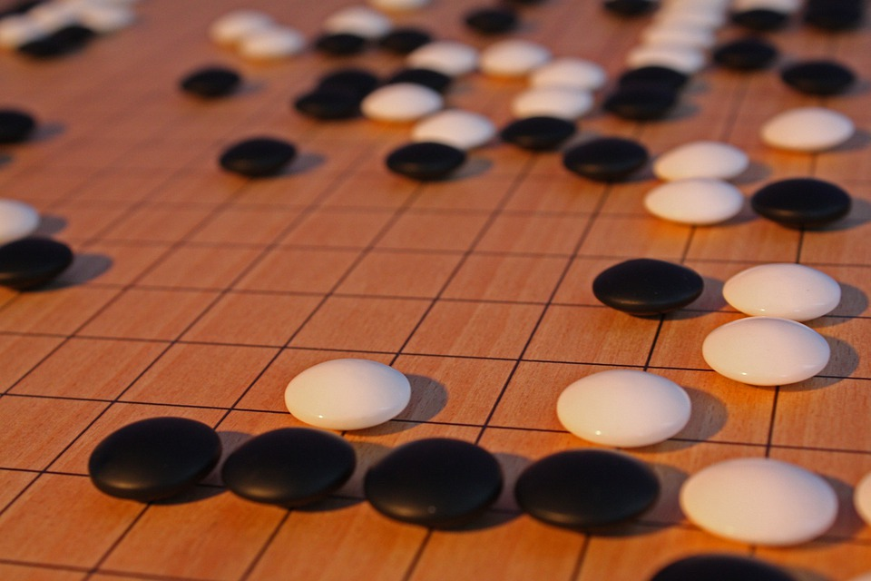

# Dossier de présentation Festi'Thé Maulévrier

<!--
- demander organisation avec l'équipe du parc
- prévenir que le programme et les photos sont sans certitude
-->

## Objectif

> Un festival pour revenir aux sources, sans nuage de lait, ni arômes ajoutés.
Des feuilles de Thé, de l’eau chaude, un peu de savoir faire et c’est tout.

Trois jours de rencontres, d'ateliers et de conférences autour du Thé authentique chinois et de la culture chinoise traditionnelle. L'occasion pour les personnes professionnelles, amatrices et néophytes de se retrouver et d'échanger autour du Thé et du monde chinois. Nous projetons d'organiser cet évènement du 8 au 10 juillet 2022, au [Parc Oriental de Maulévrier](https://www.parc-oriental.com).

## Présentation de l'équipe

Cet évènement est co-organisé par Jérôme Roussel - [Jé le Potier](https://www.theiere-tasse.com), et les membres de l'association [Brut de Thé](https://www.brutdethé.fr) : Stéphane Langlois, Thaïs Erbs et Violaine Andrieux, tout trois amateurs de Thé.

### Violaine Andrieux

Violaine, grande consommatrice de Thé depuis un voyage prolongé sur les terres anglo-saxones et, pendant de nombreuses années, inséparable de sa tasse d'Earl Grey, découvre la finesse et la subtilité du Thé traditionnel chinois en rencontrant Stéphane. Depuis, elle s'émerveille devant chaque nouveau Thé dégusté et se forme à la culture en lien avec cette boisson ancestrale. 

### Thaïs Erbs

Thaïs est tombé dans le Thé lors de son premier long séjour en Chine, alors qu’il fêtait ses 17 ans. Cette passion ne l’a pas quitté depuis et s’est concrétisée véritablement lors de son deuxième long séjour débuté en 2014 durant lequel il a obtenu les certificats de testeur de thé 评茶圆 - *PǐngCháYuán* et maitre de cérémonie 茶艺师 - *CháYìShī* (Occupation Qualification Certificate) auprès du ministère des ressources humaines chinois. 

> Adepte des jardins de Thé, des maisons de Thé traditionnelles, des marchés de Thé et des écoles de Thé, je suis guidé par la volonté de découvrir l'univers profond du Thé traditionnel chinois et je partage ma passion avec le plus grand nombre de personnes possible. Tradition et authenticité sont les deux valeurs qui m'animent.

### Stéphane Langlois

Stéphane est amateur des Thés de Chine et de Taïwan, il travaille également autour des pratiques collaboratives et la culture des communs.

> C’est Vivien Messavant, propriétaire de l'échoppe [Thé de Chine](https://thesdechine.business.site), qui a attisé ma curiosité en me faisant découvrir le monde des Thés de Chine et de Taïwan. Je suis ensuite devenu élève de [YaLin Bizien](https://ecoledethe.com), maître Thé à  à Rezé (44) pour poursuivre mon apprentissage.  

### Jé le Potier

Jérôme Roussel est un céramiste spécialisé dans l'univers du thé. Il exerce depuis 9 ans ce métier.

> C'est en fabriquant des théières que, petit à petit, les subtilités de fabrication se révèlent, la naïveté s'estompe pour laisser place à une meilleure compréhension de l'objet.

## Pourquoi le parc oriental de Maulévrier ?

Nous imaginons le parc comme une fenêtre sur le Japon et sur les différents pays d'Asie.  

Le jardin offre les conditions rêvées pour la réalisation de cet évènement : espace, nature, moyens logistiques et de communication, cohérence avec le thème de l'évènement.  

Cela nous semble idéal d'être au cœur d'un jardin Japonais, dans un lieu exceptionnel propice à la contemplation, pour échanger autour du Thé. Et, organiser des rencontres autour de la culture chinoise du Thé dans le plus grand jardin japonais d'Europe nous apparaît comme une opportunité et un défi insolite à relever.

Au même titre que la théière reçoit le thé à infuser, nous percevons le parc de Maulévrier comme un écrin qui met en lumière les différents rendez-vous de cet évènement. 

## Nos valeurs

- **Qualité** : Nous privilégions la qualité à la quantité, l'artisanat à l'industrialisation et nous préférons construire un évènement à taille humaine plutôt qu'un grand festival.
- **Tradition** : Nous respectons les traditions historiques en nous basant sur les savoirs originels du Thé. Nous recherchons l'authenticité, nous étudions et transmettons des savoir-faire conformes à la tradition. 
- **Enthousiasme** : Nous cultivons la joie et le plaisir de faire et nous souhaitons les partager avec l'ensemble des personnes qui vont organiser ou participer à cet évènement. 

### Les principes attachés à nos valeurs

- S’immerger chaque année à la rencontre des acteurs du Thé.
- Organiser un évènement à taille humaine.
- Réunir des personnes issues des différents métiers du Thé pour construire ensemble une culture commune sur le Thé traditionnel en France.
- Encourager la diversité, l’auto-organisation et le travail en petits groupes.
- Inviter des personnes inspirantes, créatives, expertes et sympathiques.
- Veiller à instaurer un cadre convivial et bienveillant pour tout le monde, sans distinction aucune.
- Apprendre de domaines transverses : recherche, culture, tradition, artisanat, santé, agriculture, etc.
- Transmettre nos expériences, notre savoir-faire.
- Réfléchir à des problématiques communes pour donner un sens à nos actions.
- Expérimenter en continu pour apprendre de nos erreurs aussi bien que de nos succès.
- Offrir des produits sains et locaux (quand cela est possible) dans le respect des traditions du Thé.

## Descriptif du projet

### Les publics

#### Les personnes visiteuses du parc 

Ce public varié dans l'âge (7 à 87 ans) et plutôt familial, vient visiter un jardin oriental et nous supposons qu'il s'intéressera naturellement aux Thés traditionnels, éléments essentiels de la culture chinoise et japonaise.  

 

#### Les personnes amatrices de Thé

En complément des visiteurs du parc, le festival va intéresser un public plus averti.  
Le réseau des personnes amatrices de Thés traditionnels regroupe les céramistes spécialisés, les maîtres de Thés qualifiés dans les cérémonies (茶艺) et les infusions (泡茶), les cultivateurs de Thés français et les responsables d'écoles ou d'associations de Thé.  

#### Les buveurs de thé

Nous accueillerons également les personnes qui consomment du thé occasionnellement. Ce sera l'opportunité pour elles de découvrir un univers à part entière et d'obtenir des connaissances nouvelles dans ce domaine.

#### Les médias

Nous inviterons des personnes journalistes, autrices, blogueuses qui s'intéressent au monde du Thé, du bien-être, de l'alimentation, du jeu de go et de la culture Chinoise en général.  

#### Les associations culturelles chinoises

Le festival pourra intéresser des associations locales et nationales reliées de près ou de loin avec le monde chinois, notamment l'institut Confucius, et l'association 正心堂 - _ZhèngXīnTáng_. 

#### Les amateurs de culture chinoise traditionnelle

Le festival est l'occasion pour les personnes intéressées par la culture chinoise authentique de venir découvrir une petite partie de Chine par la petite fenêtre que nous souhaitons ouvrir à Maulévrier. 

### Les thèmes

#### les Thés de Chine et de Taiwan

Au XVIIIe siècle, la colonisation a particulièrement développé l'essor du Thé en Europe et en Amérique, avec, par exemple, la production industrielle en Inde par les anglais. Le développement du Thé au Japon remonte quant à lui au XIIe siècle.  
La Chine est le berceau historique du Thé. On trouve les traces de pollen de fleurs de théiers les plus anciennes dans la province de Guizhou, en Chine.  
La consommation de feuilles de théiers démarrerait, selon la légende de Shennong, aux alentours de -2730, là aussi en Chine.   

Comme pour le vin, il existe en chine différents terroirs avec des spécificités et des procédés de transformations traditionnels. Les six plus une couleurs de Thés (vert, blanc, jaune, bleu-vert, rouge, noir et Pu'er) offrent une diversité de plus de 4000 crus issus de *cultivars* différents.   

#### La culture chinoise traditionnelle

En plus du Thé, partie dominante du festival, d'autres thèmes satellites seront présentés, toujours dans l'esprit de la tradition chinoise authentique :

- Cuisine chinoise : présence d'un ou de plusieurs spécialistes de la cuisine chinoise proposant de la dégustation sur place et des ateliers.

- Calligraphie chinoise : démonstrations et ateliers

- Encens chinois : démonstrations et ateliers autour de l'encens traditionnel chinois

- 圍棋 - _WéiQí_ (Jeu de Go) : ateliers avec [FanHui](https://fr.wikipedia.org/wiki/Fan_Hui) trois fois champion d'europe 

- Santé et massage : découverte de la pharmacoppée traditionnelle chinoise et massage 推拿 - _Tuīná_

- 氣功 - _QìGōng_, 太極拳 - _TàiJíQuán_, 武術 - _WǔShù_ : découverte et initiation

- 易經 - _YìJīng_ : ateliers et introduction au livre des changements avec l'association Djohi 
=======
La Chine est le berceau historique du thé. On trouve les traces de pollen de fleurs de théiers les plus anciennes dans la province de Guizhou (貴州), en Chine.  
La consommation de feuilles de théiers démarre selon la légende de Shennong (神農) aux alentours de -2730 a.e.c, là aussi en Chine.   

Comme pour le vin, il existe en Chine différents terroirs avec des spécificités et des procédés de transformations traditionnels. Les six+1 couleurs de Thés : vert, blanc, jaune, bleu-vert, rouge, noir et Pu'er (普洱茶), offrent une diversité de plus de 4000 crus issus de *cultivars* différents.   

#### La culture chinoise traditionnelle

En plus du thé, partie dominante du festival, d'autres thèmes satellites seront présentés, toujours dans l'esprit de la tradition chinoise authentique.

- **La cuisine chinoise** : Nous proposons de découvrir une cuisine chinoise authentique loin des stéréotypes associés à cette cuisine. L'occasion de découvrir des jeunes chefs qui allient audace et tradition pour revisiter les arts culinaires de Chine.  
Par exemple : Yam'Tcha : https://www.instagram.com/yamtchaparis

- **Le jeu de Go** : en chinois WéiQi (围棋) est un jeu de stratégie abstrait pour 2 joueurs d'origine chinoise qui est pratiqué dans toute l'Asie.  
Les ateliers seront proposés par FanHui (樊麾) champion d'Europe : 2013, 2014 et 2015

- **La calligraphie chinoise** :  démonstrations et ateliers

- **L'encens chinois** : démonstrations et ateliers autour de l'encens traditionnel chinois.

- **Santé et massage** : découverte de la pharmacopée traditionnelle chinoise et massage 推拿 - _Tuīná_

- **易經 - _YìJīng_** : ateliers et introduction au livre des changements avec l'association Djohi 

### Actualité du Thé

#### En France

Malgré le contexte sanitaire, les deux dernières années ont vu l'émergence d'une communauté active autour du Thé traditionnel. En 2020, l'Agence pour la Valorisation des Produits Agricoles a récompensé le Thé blanc produit par Michel Thévot dans le Finistère. En janvier 2021, une dizaine de producteurs se sont rassemblés pour créer l'Association Nationale des Producteurs de Thé Français (ANVPTF) pour partager leur expérience, valoriser et professionaliser la filière de production de Thé en France. En Bretagne, les personnes pionnières, WeiZi et Denis Mazerolle, sont passées aux choses sérieuses en plantant plus de 20000 pieds et vise les 90000 pieds d'ici à 2024.   

Pendant le confinement, quelques acteurs ont choisi de sortir du confort du marché des thés aromatisés pour développer une activité autour des Thés traditionnels. C'est le cas par exemple de Théine à Nantes. D'autres ont choisi de consolider leurs activités grâce à la vente en ligne, comme par exemple NeoT, Tencha et Brut de Thé.  

Sur le terrain, nous constatons un intérêt grandissant, de nombreux projets autour du Thé émergent. Les acteurs de ce secteurs agissent de différentes manières :

- la promotion et la vente du Thé nature au sein de boutiques spécialisées ouvertes par des passionnés qui sourcent eux-mêmes leurs produits.
- L'apparition sur les réseaux sociaux de bloggeurs ou vloggeurs, qui axent leurs diffusions uniquement sur le Thé.
- La création d'une revue spécialisée sur le Thé : "Histoire de Thé"
- La présence de céramistes français qui dédient leur travail uniquement à l'univers du Thé.
- La rédaction d'ouvrages de référence sur le Thé par des auteurs français.

#### En Europe et dans le monde

Différents pays organisent déjà des évènements autour du thé. C'est le cas des Etats-Unis avec le Festival International du Thé qui se déroule depuis plusieurs années à San Francisco ou Las Vegas qui accueille le World Tea Expo.  
Plus près de nous, Berlin verra en 2022 la 3e édition de son Festival du Thé.  
Chaque année, ce sont plus de 60 évènements d'envergure autour du thé qui s'organisent dans le monde.  
À Camden (Londres), Don Mei via sa boutique *Mei Leaf* produit des reportages vidéo. Il a capté un large public sur *Youtube* en proposant des contenus spécifiques sur le thé traditionnel Chinois.  

## Le projet

Nous avons imaginé organiser un évènement sur trois jours, du vendredi au dimanche, en proposant différentes animations : ateliers, expositions, conférences, bar à Thés, échoppes. Un évènement pour rassembler un échantillon représentatif des personnes actrices dans l'univers du Thé et du monde chinois traditionnel. 

### Conférences

#### Débutants

- Le nouveau monde du Thé : Léo
- Le Thé à Taiwan : Ya-Lin
- La démarche d'un potier : Jé le potier
- Présentation des types de Thés : Thaïs Erbs
- Cultiver du Thé en France : Thomas Bernardi, Denis Mazerolle
- Les ustensiles du Thé et le vocabulaire
- Lien entre Thé et colonialisme
- L'histoire du Thé : George Van Driem (Bern) - the tale of tea
- Tea travelers : 2 personnes françaises globe-trotter du Thé

#### Dégourdies

- Les tanins : Marc-André Selosse
https://www.tela-botanica.org/2020/02/les-tannins-des-plantes-de-lecologie-a-la-sante-une-conference-a-revoir-en-ligne
- L'infusion parfaite : Thaïs Erbs
- Les Pu'eR pour de vrai : Olivier Schneider
- Les Wulong : Jakez Hubert
- MeiLeaf : Don Mei - Camden - London - UK
- Teapicure : The NewNewNew types

#### Lightning talk : 10'
Un discours éclair, une présentation très courte pour aborder divers sujets autour du Thé, pour inviter à la réflexion et donner envie d'approfondir. 

Quelques exemples : 
- Bien choisir son eau
- L'histoire du Tie Guan Yin
- Thé et santé
- Tao du thé
<<<<<<< Updated upstream
- Pélerins du Thé
- Rosé pamplemousse et surimi

### Dédicaces
Ce festival pourrait être l'occasion pour les plumes amatrices de Thé de présenter leurs ouvrages et d'en dédicacer certains.
- Arnaud Bachelin
=======
- Pélerins du thé
- Le thé industriel : rosé pamplemousse et surimi
>>>>>>> Stashed changes

### Ateliers

- La cérémonie du Thé 無我茶會 - *WúWǒ*
- GongFuCha - Charly, Thaïs
- Dégustations à l'aveugle
- Troc de Thé, troc de graine, troc d'ustensiles
- Céramiques et cuisson - http://www.latelierdamelius.fr
- Elaboration de quelques classiques de la cuisine chinoise
- Atelier de Calligraphie - YaLin
- Jeu de Go 圍棋 - *WéiQí*

### Bar à thés

Les meilleures conférences ne pouvant remplacer l'expérience magique de la dégustation. Nous souhaitons reproduire l'ambiance de petites maisons de thé populaire - 野茶馆 - *YěCháGuǎn* pour que les personnes puissent s'arrêter quelques minutes ou plusieurs heures et savourer de nombreux crus venus de Chine et de Taïwan.

Photos échoppes

## Intervenant·e·s

- cultivateurs
- céramistes
- vendeurs
- amateurs
- auteurs
- maître de thé
- experts : tanin, l'eau, cultivar
- animatrices et animateurs (conférences, ateliers)
- praticiens en médecine chinoise

## Quelques exemples de conférences

### La chimie du Thé

« La chimie du Thé est complexe. Complexe comment ? Eh bien, à l’état brut, les feuilles de Thé contiennent des milliers de composés chimiques. Lorsque les feuilles de Thé sont infusées, les composés chimiques qu’elles contiennent se décomposent et forment de nouveaux composés. Nos sens sont émoustillés par les milliers de composés volatils (collectivement appelés « complexe aromatique ») qui s’élèvent de la liqueur de Thé et les milliers de composés non volatils qui flottent dans la liqueur de Thé. Pour cette raison, le Thé est connu comme le maître de la diversité chimique ». Une grande partie de la chimie du Thé, du champ à la tasse, est encore inconnue ! Cette conférence, présentée par Tony Gebely, propose une exploration dans le monde complexe de la chimie du Thé.

**Tony Gebely**
*Au cours de ses 13 années d’expérience dans le domaine du Thé, Tony Gebely a travaillé pour de nombreuses sociétés de Thé de premier plan, les aidant à s’orienter dans le secteur florissant des spécialités de l’industrie du Thé. Tony est également le fondateur du site Web World of Tea. Ayant beaucoup voyagé dans les régions productrices de Thé au cours de sa vie et ayant un diplôme en informatique, il a développé une approche pragmatique du Thé qui l’a conduit à écrire, en 2016, son traité* Tea : Un guide de l’utilisateur. *Tony continue d’être un étudiant de la feuille et travaille actuellement sur son deuxième livre et sert de directeur exécutif pour l’American Specialty Tea Alliance.*

### Histoire de Thés entre ici et Taïwan

Taïwan a été le pionnier de l’innovation dans les méthodes de traitement du thé wulong, passant de la méthode traditionnelle à forte intensité de main-d’œuvre à une procédure moderne de fabrication du Thé, mécanisée et à fort volume. Dans cette conférence, Ya-Lin présentera l’objectif de chaque étape du traitement du Thé wulong, les machines et l’évolution à Taïwan au cours des 35 dernières années.

**Ya Lin**

*Qualifiée maître-assistante de l’art du Thé chinois par « Chinese Tea Culture Academy » à Taïwan. Née à Taipei, son premier maître de Thé était son grand-père maternel, un amateur passionné de Thés. C’est lui qui lui a transmis les racines, le goût et l’amour de cette culture du Thé. Elle est une disciple du maître Fan, maître de Thé renommé à Taïwan et en Chine. Son ambition ? Montrer le goût authentique, la culture et la Voie du Thé chinois au plus grand nombre.*

## Portraits d'exposant·e·s
    
### Manon Clouzeau

Manon ne pratique qu’un seul style de céramique : les bols. Parce qu'elle aime profondément cette forme-là. Elle est dans une pratique très, très simple parce qu’elle aime la simplicité.  
  
Avec un bol, elle arrive à faire un gaiwan ou une verseuse, juste en adaptant les courbes ou en ajoutant un petit coup de doigt sur le bec. 

>[...] J'aime les bols, j'aime les nuances, j'aime la matière. J'aime être avec toutes mes subtilités... Je crée tout autour du bol, tel un petit caillou que je sème sur le sable humide après le passage de l'eau. J'aime boire, j'aime déguster au centre d'une terre émaillée. J'aime partager, j'aime échanger, j'aime vivre. Alors, bienvenue dans mon univers aux mille nuances, aux mille matières, aux mille rires.[...]
> [...] Mon insipiration, c'est tout ce qui me touche, une lumière, une couleur, une présence, un frisson, un instant, une respiration, un regard, un arbre nu, une voix, un plaisir... *extrait d'un interview par l'Atelier*

### Perrine Pottiez

Autodidacte dans le travail de modelage, elle découvre sa vocation en 2014. À partir d'une balle d'argile pincée, explorée, caressée longuement, elle exprime sa créativité. De l'argile ramassée par ses soins, de l'eau, du feu et tout l'univers de Perinne prend forme.  

> D'un peu d'argile, les objets prennent vie entre mes mains, lentement  
> Je les espère poétiques, inattendus, organiques, graciles  
> J'y vois la poésie de l'objet ordinaire, un geste ancestral perpétué, la beauté d'une imperfection, la simplicité  
> De poudres et d'eau, de feu, de sueur et de patience, comme une empreinte sur l'éternité

## Communication

Le plan de communication sera défini en partenariat avec le service du parc de Maulévrier.

Le site internet : https://festival.brutdethé.fr sera consolidé jusqu'au jour de l'évènement pour intégrer les informations actualisées du programme et des informations pratiques.
Une vidéo pour informer et promouvoir l'évènement sera réalisée et diffusée sur les réseaux sociaux. Nous sommes en contact avec les journaux spécialisés et les boutiques pour les aider à présenter l'évènement.

## Budget

Dans la présentation de ce modèle économique, le parc de Maulévrier ne facture pas de prestation de location.  

La billeterie du parc n'est pas impactée par l'évènement, les tarifs sont les mêmes et la recette revient intégralement au parc.

### Dépenses

| poste dépense | montant    |
| ------------- | ---------- |
| papeterie     |  200 €     |
| hébergement   | 1500 €     |
| eau/thé       |  180 €     |
| transport     |  500 €     |
| aménagement   | 3000 €     |
| com' pro      |  500 €     |
| loc vehicule  |  300 €     |
| rémunération  | 5000 €     |
| divers        |  500 €     |
| **Total**     | **11680 €** |

### Recettes

| poste recette       | montant     |
| ------------------- | ----------- |
| 15% sur CA          | 1000 €      |
| B2T thé             | 1500 €      |
| participation libre |  180 €      |
| subvention          | 9000 €      |
| **Total**           | **11680 €** |

### Sponsors

| poste dépense | financement | montant |
| ------------- | ----------- | ------- |
| site web      | scopyleft   | 4500 €  |
| céramique bol | M. Clouzeau | 3500 €  |

## Liens 

- [WeiZi et Denis Mazerolle, Filleule des thés](https://filleule-des-fees.fr)
- [Pauline Miranda](https://www.montpellier-acupuncture.fr/)
- [Manon Clouzeau](https://manonclouzeau.com)
- [article de Manon Clouzeau](https://www.pugs-and-pigs.com/fr/blogs/articles/in-exhibition-manon-clouzeau)
- [George Van Driem](https://en.wikipedia.org/wiki/George_van_Driem)
- [Brut de Thé](https://www.brutdethé.fr/)
- [Thomas Bernardi](https://www.youtube.com/watch?v=SIDnZIhg0ME)
- [Jé le Potier](https://www.theiere-tasse.com/)
- [Perrine Pottiez](https://www.perrinepottiez.com/)
- [Yam'Tcha](https://boutique.yamtcha.com/)
- [Mei Leaf](https://www.youtube.com/channel/UCaHBABJFMRAtnKhQp2Cu5BQ)

- 
